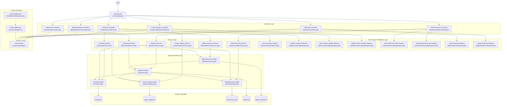

## System Architecture

```mermaid
flowchart TD
    User(("User"))
    Routes["Web Routes<br/>[routes/web.php]"]

    User --> Routes

    subgraph Controllers["Controller Layer"]
        CompanyController["Company Controller<br/>[CompanyController.php]"]
        CategoryController["Cargo Category Controller<br/>[CargoCategoryController.php]"]
        BayController["Warehouse Bay Controller<br/>[WarehouseBayController.php]"]
        ShipmentController["Shipment Controller<br/>[ShipmentController.php]"]
        BillingController["Billing Statement Controller<br/>[BillingStatementController.php]"]
        DashboardController["Dashboard Controller<br/>[DashboardController.php]"]
    end

    Routes --> CompanyController
    Routes --> CategoryController
    Routes --> BayController
    Routes --> ShipmentController
    Routes --> BillingController
    Routes --> DashboardController

    subgraph FormRequests["Form Request Validation Layer"]
        StoreCompanyRequest["Store Company Request<br/>[StoreCompanyRequest.php]"]
        UpdateCompanyRequest["Update Company Request<br/>[UpdateCompanyRequest.php]"]
        StoreCategoryRequest["Store Cargo Category Request<br/>[StoreCargoCategoryRequest.php]"]
        UpdateCategoryRequest["Update Cargo Category Request<br/>[UpdateCargoCategoryRequest.php]"]
        StoreBayRequest["Store Warehouse Bay Request<br/>[StoreWarehouseBayRequest.php]"]
        UpdateBayRequest["Update Warehouse Bay Request<br/>[UpdateWarehouseBayRequest.php]"]
        StoreShipmentRequest["Store Shipment Request<br/>[StoreShipmentRequest.php]"]
        UpdateShipmentRequest["Update Shipment Request<br/>[UpdateShipmentRequest.php]"]
    end

    CompanyController --> StoreCompanyRequest
    CompanyController --> UpdateCompanyRequest
    CategoryController --> StoreCategoryRequest
    CategoryController --> UpdateCategoryRequest
    BayController --> StoreBayRequest
    BayController --> UpdateBayRequest
    ShipmentController --> StoreShipmentRequest
    ShipmentController --> UpdateShipmentRequest

    subgraph Services["Service Layer"]
        CompanyService["Company Service<br/>[CompanyService.php]"]
        CategoryService["Cargo Category Service<br/>[CargoCategoryService.php]"]
        BayService["Warehouse Bay Service<br/>[WarehouseBayService.php]"]
        ShipmentService["Shipment Service<br/>[ShipmentService.php]"]
        BillingService["Billing Statement Service<br/>[BillingStatementService.php]"]
        DashboardService["Dashboard Service<br/>[DashboardService.php]"]
    end

    CompanyController --> CompanyService
    CategoryController --> CategoryService
    BayController --> BayService
    ShipmentController --> ShipmentService
    BillingController --> BillingService
    DashboardController --> DashboardService

    subgraph Models["Eloquent Model Layer"]
        CompanyModel["Company Model<br/>[Company.php]"]
        CategoryModel["Cargo Category Model<br/>[CargoCategory.php]"]
        BayModel["Warehouse Bay Model<br/>[WarehouseBay.php]"]
        ShipmentModel["Shipment Model<br/>[Shipment.php]"]
        BillingModel["Billing Statement Model<br/>[BillingStatement.php]"]
    end

    CompanyService --> CompanyModel
    CategoryService --> CategoryModel
    BayService --> BayModel
    ShipmentService --> ShipmentModel
    BillingService --> BillingModel

    DashboardService --> ShipmentModel
    DashboardService --> CompanyModel
    DashboardService --> CategoryModel
    DashboardService --> BayModel
    DashboardService --> BillingModel

    ShipmentModel --> CompanyModel
    ShipmentModel --> CategoryModel
    ShipmentModel --> BayModel
    BillingModel --> ShipmentModel

    subgraph Database["MySQL / MariaDB"]
        CompaniesTable[("companies")]
        CategoriesTable[("cargo_categories")]
        BaysTable[("warehouse_bays")]
        ShipmentsTable[("shipments")]
        BillingTable[("billing_statements")]
    end

    CompanyModel --> CompaniesTable
    CategoryModel --> CategoriesTable
    BayModel --> BaysTable
    ShipmentModel --> ShipmentsTable
    BillingModel --> BillingTable

    subgraph Frontend["Inertia and React"]
        ReactApp["React Application<br/>[resources/js/app.tsx]"]
        InertiaPages["Inertia Pages<br/>[resources/js/pages/]"]
        InertiaMiddleware["Inertia Middleware<br/>[HandleInertiaRequests.php]"]
    end

    CompanyController --> InertiaPages
    CategoryController --> InertiaPages
    BayController --> InertiaPages
    ShipmentController --> InertiaPages
    BillingController --> InertiaPages
    DashboardController --> InertiaPages

    ReactApp --> InertiaPages
    InertiaMiddleware -.-> ReactApp
```
